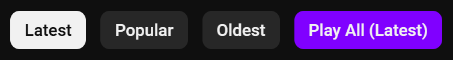
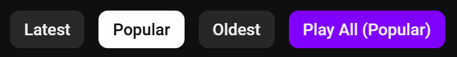
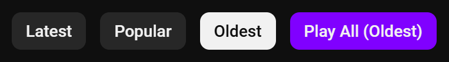

# Youtube Play All

Youtube Play All is a browser extension that adds a "Play All" button to YouTube's **Videos**, **Shorts**, and **Streams** pages. This button allows you to play all videos in the selected sorting order: **Latest**, **Popular**, or **Oldest**.

## Features
- Adds a **Play All** button to YouTube's video list pages.
- Supports three sorting options:
  - **Latest**: Play videos in chronological order from newest to oldest.
  - **Popular**: Play videos sorted by popularity.
  - **Oldest**: Play videos in chronological order from oldest to newest. (*Only works on the 'Videos')

## Screenshots

### All patterns

## Usage
1. Download the extension from the [Chrome Web Store] or [Firefox Add-ons].
2. Open any YouTube channel and go to the **Videos** tab. (e.g., [MrBeast Videos]).
3. Choose a sorting option (**Latest**, **Popular**, **Oldest**).
4. Click the **Play All** button to play videos in the chosen order.

[Chrome Web Store]: https://chromewebstore.google.com/detail/youtube-play-all/lcgfhpllcjejniehjnhbfhnkdpmkeoce
[Firefox Add-ons]: https://addons.mozilla.org/firefox/addon/youtube-play-all/
[MrBeast Videos]: https://www.youtube.com/@MrBeast/videos
