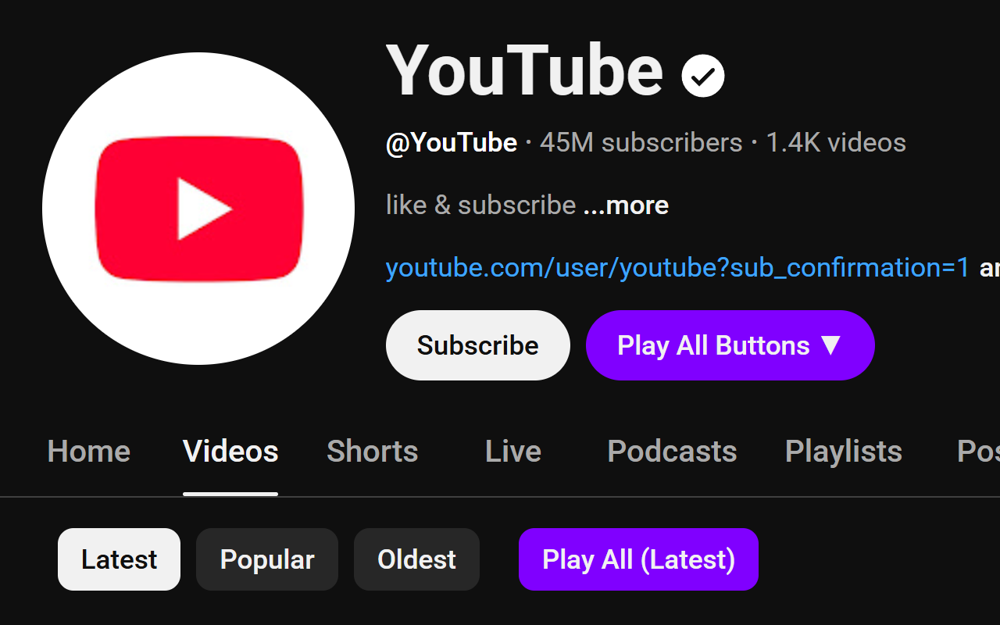
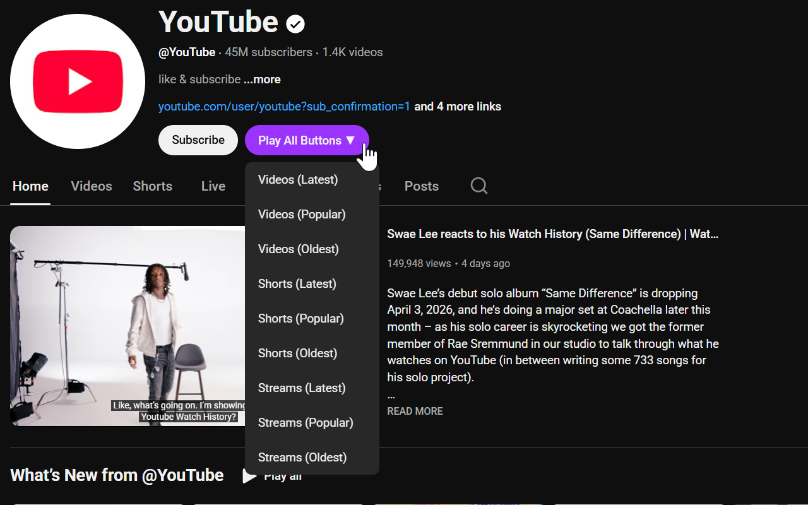

# Youtube Play All

Youtube Play All is a browser extension that adds "Play All" buttons for Videos, Shorts, and Streams on YouTube, with sorting by Latest, Popular, or Oldest.

## Features

- Adds "Play All" buttons to YouTube channel pages.
- Supports category options (Videos, Shorts and Streams)
- Supports sort options (Latest, Popular and Oldest)
  \*Oldest playlist are all video types are mixed — YouTube does not support separate sort.
- Supports mobile pages.

## Screenshots

## Usage

1. Download the extension from the [Chrome Web Store] or [Firefox Add-ons].
2. Open any YouTube channel and go to the Videos tab. (e.g., [@YouTube]).
3. Choose a sorting option (Latest, Popular, Oldest).
4. Click the "Play All" button to play videos in the chosen order.

[Chrome Web Store]: https://chromewebstore.google.com/detail/youtube-play-all/lcgfhpllcjejniehjnhbfhnkdpmkeoce
[Firefox Add-ons]: https://addons.mozilla.org/firefox/addon/youtube-play-all/
[@YouTube]: https://www.youtube.com/@YouTube/videos

## Issues

Report any issues or bugs here:
https://github.com/CatBraaain/browser-youtube-play-all/issues
